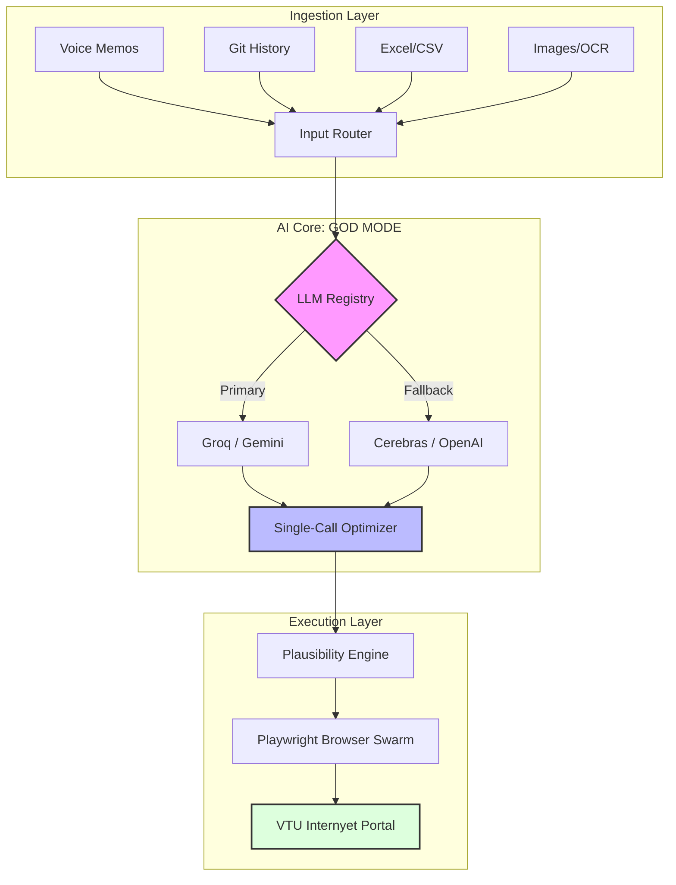

# VTU Diary Automation v3.0 — GOD MODE

<div align="center">



**Industrial-grade internship diary generation and automated submission for VTU's Internyet portal.**

[Getting Started](#-getting-started) • [Architecture](#-architecture) • [Supported Formats](#-supported-input-formats) • [Docker](#-docker-deployment)

</div>

---

### Core Capabilities

| 📥 **Universal Ingestion** | 🧠 **AI Intelligence** | 🤖 **Swarm Execution** |
| :--- | :--- | :--- |
| **All-Input Processing** <br> Accepts voice memos, Excel logs, git histories, and document scans without configuration. | **Multi-LLM Fallback** <br> Seamless transitions between Groq, Gemini, and OpenAI to ensure 100% uptime and zero cost. | **Playwright Automation** <br> High-speed submission using recorded browser selectors and session state management. |
| **Plausibility Guard** <br> Real-time scoring system that prevents generation of overly "AI-sounding" or repetitive entries. | **Single-Call Logic** <br> Generates months of structured records in one API request to minimize latency and token usage. | **Self-Healing UI** <br> Dynamic detection of portal changes with auto-fixing button triggers and form dispatching. |

---

## 🚀 Quick Start

### 1. Project Setup
```bash
# Install Backend
cd backend
pip install -r requirements.txt
playwright install chromium

# Build Frontend
cd ../frontend
npm install && npm run build
```

### 2. Configuration
Create a .env file in the root directory:
```bash
VTU_EMAIL=student@vtu.ac.in
VTU_PASSWORD=your_password

# Fast Free Tiers
GROQ_API_KEY=gsk_xxxxx
GEMINI_API_KEY=AIza_xxxxx
```

### 3. Execution
```bash
cd backend
python app.py
# Access dashboard at http://localhost:5000
```

---

## 📥 Supported Input Formats

The system utilizes an intelligent **Input Router** to parse various data streams:

| Format | Capability |
| :--- | :--- |
| **Audio (.mp3, .wav)** | Whisper-powered transcription of voice notes into structured task logs. |
| **Excel / CSV** | Auto-header detection for Date, Task, Duration, and Skills columns. |
| **Git Repositories** | Automatic extraction of commit messages and PR descriptions for engineering diaries. |
| **PDF / Text** | Deep parsing of weekly reports or meeting minutes into daily activity segments. |

---

## 🏗️ Architecture

### Intelligence Pipeline
The **"GOD MODE"** engine transforms raw, messy data into high-quality engineering records using a multi-stage pipeline:

1. **Mapping:** Distributes raw tasks across the selected calendar range, honoring weekends and holidays.
2. **Synthesis:** A monolithic LLM call generates the entire diary period, ensuring narrative consistency (e.g., "Started X on Monday, finished X on Wednesday").
3. **Plausibility:** Analyzes word count, skill relevance, and repetition to ensure entries are "Goldilocks" level — detailed enough to pass but not suspicious.
4. **Submission:** Orchestrates a sequential Playwright swarm to handle portal login, internship selection, and form submission.

---

## 🐳 Docker Deployment

The fastest way to deploy the full stack.

```bash
docker-compose up --build -d
```

| Service | Address | Role |
| :--- | :--- | :--- |
| **Backend API** | `localhost:5000/api` | Logic, AI, and Browser Engine |
| **Frontend Web** | `localhost:5000` | Management Dashboard |
| **API Docs** | `localhost:5000/docs` | Fully interactive Swagger documentation |

---

## 🛠️ Troubleshooting

- **Submission Failed:** Ensure your VTU_EMAIL and VTU_PASSWORD are correct. If the portal has updated its UI, check for a "Self-Healing" console log.
- **Quota Exceeded:** The engine will automatically try the next provider. Add multiple API keys to .env for maximum resilience.
- **Docker Issues:** Ensure your host has at least 2GB of RAM to run the Playwright browser instances within containers.

---

<div align="center">
Built with Playwright, FastAPI, and React. MIT Licensed.
</div>
